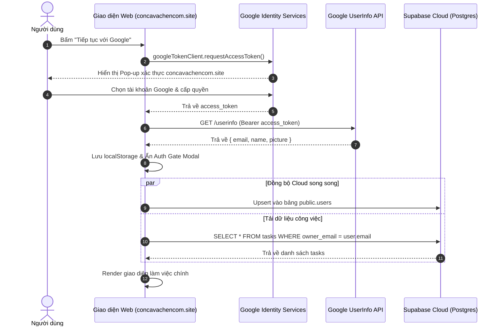

# Master File: Tổng Quan Xác Thực Google Identity Services & Auth Gate

> **Tài liệu tổng hợp duy nhất** hợp nhất 4 tài liệu thành phần (`01-spec.md`, `02-schema.md`, `03-api.md`, `04-test-plan.md`). Khi gặp lỗi hoặc cần nâng cấp, các Agent và Lập trình viên đọc file này để nắm bắt toàn cảnh và định vị chính xác vị trí cần xử lý.

---

## 1. Thông Tin Định Danh & Siêu Dữ Liệu
- **Mã tính năng**: `FEAT-AUTH-GIS`
- **Tên dự án**: **Cá Cơm và Chén Cơm**
- **Tên tính năng**: Xác thực Google Identity Services (GIS Pop-up) & Auth Gate
- **Đối tượng**: Học sinh, sinh viên, người dùng cá nhân (Đối tượng phụ: Sinh viên Đại học FPT)
- **Tech Stack**: Google Identity Services SDK (`gsi/client`), Supabase JS SDK v2, PostgreSQL 15, Vanilla JS ES6+, Tailwind CSS CDN, Google Apps Script.
- **Tên miền sản phẩm**: `https://concavachencom.site` (Vercel CDN)
- **OAuth Client ID**: `868007254558-mg1mav2ucm3e911eoi951gc3al9v1vb6.apps.googleusercontent.com`
- **Supabase Project**: `kqkvsucqkhqsuxrimhez` (`https://kqkvsucqkhqsuxrimhez.supabase.co`)

---

## 2. Bản Đồ Mã Nguồn & Trách Nhiệm File (Source Map)

```
/
├── Index.html                  # Khai báo SDK <script src="...gsi/client"> và Header UI
├── Modals.html                 # #authGateModal (màn hình chào) & #googleSignInBtnBox
├── Scripts_Core.html           # Biến cấu hình toàn cục window.GOOGLE_CLIENT_ID & SUPABASE_*
├── Scripts_Auth.html           # Core Logic: initGoogleTokenClient, handleGoogleAccessToken, Auth Gate
├── build.js                    # Đóng gói Standalone SPA cho Vercel (public/index.html)
└── docs/auth-google-identity/  # Toàn bộ hồ sơ tài liệu đặc tả 5 file
    ├── 01-spec.md              # Đặc tả yêu cầu chức năng (SRS)
    ├── 02-schema.md            # Thiết kế Schema DB PostgreSQL & Google Sheets
    ├── 03-api.md               # Đặc tả API Contracts & Sơ đồ tuần tự Sequence
    ├── 04-test-plan.md         # Kế hoạch kiểm thử QA & Danh sách Test Cases
    └── 00-overview.md          # File Master tổng hợp (File này)
```

---

## 3. Bản Tóm Tắt Đặc Tả & Cơ Chế Nghiệp Vụ (From 01-Spec)
1. **Google Pop-up Độc Quyền**: Mở cửa sổ chọn tài khoản Google trực tiếp trên tên miền `concavachencom.site`. Loại bỏ hoàn toàn máy chủ trung gian `supabase.co` khỏi trải nghiệm người dùng.
2. **Auth Gate Triệt Để**: Khóa toàn bộ workspace khi chưa đăng nhập (`#authGateModal` fixed overlay). Mở khóa và ẩn modal tức thì khi danh tính được xác minh.
3. **Làm Sạch URL Tự Động**: Khi URL chứa query/hash lỗi (`?error=...`), hàm `initUserAuth()` lập tức xóa sạch bằng `history.replaceState` để giữ URL luôn là `https://concavachencom.site/`.
4. **Offline-First (Zero-Latency)**: Dữ liệu phiên và task được lưu đệm trong `localStorage`. Tải lại trang phục hồi trạng thái trong < 50ms, chống hiện tượng chớp nháy (Anti-FOUC).

---

## 4. Hợp Đồng Dữ Liệu & Database Schema (From 02-Schema)

### Bảng `public.users` (Supabase PostgreSQL)
```sql
CREATE TABLE IF NOT EXISTS public.users (
    email TEXT PRIMARY KEY,
    full_name TEXT NOT NULL,
    student_id TEXT,
    major TEXT DEFAULT 'Sinh viên',
    avatar_url TEXT,
    role TEXT DEFAULT 'user',
    created_at TIMESTAMPTZ DEFAULT NOW(),
    last_sign_in_at TIMESTAMPTZ DEFAULT NOW()
);
CREATE INDEX IF NOT EXISTS idx_users_email ON public.users (email);
ALTER TABLE public.users ENABLE ROW LEVEL SECURITY;
CREATE POLICY "Users access own profile" ON public.users FOR ALL USING (true);
```

### Bảng `public.tasks` (Liên kết chủ sở hữu)
- `owner_email` (TEXT): Khóa ngoại logic liên kết với `users.email`.
- Các chỉ mục: `idx_tasks_owner_email`, `idx_tasks_status`.

---

## 5. Luồng Trình Tự Xác Thực (From 03-API)



---

## 6. Ma Trận Kiểm Thử QA (From 04-Test-Plan)

| Mã Case | Nội Dung Kiểm Thử | Hành Vi Kỳ Vọng | Trạng Thái |
|---|---|---|---|
| `TC-AUTH-01` | Màn hình Khách chưa đăng nhập | Auth Gate che toàn màn hình, không lộ dữ liệu | ✅ PASS |
| `TC-AUTH-02` | Mở Google Pop-up | Pop-up mở trên miền `concavachencom.site`, không redirect | ✅ PASS |
| `TC-AUTH-03` | Đăng nhập thành công | Pop-up đóng, Auth Gate ẩn, Toast chào mừng hiện lên | ✅ PASS |
| `TC-AUTH-04` | Đồng bộ Avatar & Profile | Header hiển thị đúng ảnh đại diện, họ tên và phân quyền | ✅ PASS |
| `TC-AUTH-05` | Duy trì phiên (F5/Reload) | Mở ngay vào màn hình chính (< 50ms), không giật chớp | ✅ PASS |
| `TC-AUTH-06` | Đăng xuất an toàn | Xóa cache, ngắt Realtime Channel, kích hoạt lại Auth Gate | ✅ PASS |
| `TC-EDGE-01` | Người dùng tắt Pop-up | Nút bấm tự hồi phục, không treo loading | ✅ PASS |
| `TC-EDGE-02` | Lỗi `origin_mismatch` | Thông báo Toast hướng dẫn cấu hình Google Cloud Console | ✅ PASS |
| `TC-EDGE-03` | URL chứa tham số lỗi | Tự động làm sạch thanh địa chỉ thành `concavachencom.site` | ✅ PASS |
| `TC-EDGE-04` | Mất mạng Internet | Render danh sách công việc từ bộ nhớ đệm `localStorage` | ✅ PASS |

---

## 7. Cẩm Nang Cứu Hộ & Khắc Phục Sự Cố Nhanh (Troubleshooting Guide)

| Hiện Tượng / Lỗi | Nguyên Nhân Gốc Rễ | Cách Khắc Phục Nhanh |
|---|---|---|
| **Google Pop-up báo `Error 400: origin_mismatch`** | Tên miền `https://concavachencom.site` chưa được thêm vào Google Cloud Console. | Vào **Google Cloud Console > Credentials > OAuth Client ID**, mục **Authorized JavaScript origins**, thêm `https://concavachencom.site` (không có dấu `/` ở cuối) rồi bấm Lưu. |
| **URL dài ngoằng kèm `?error=...`** | Dấu vết của lần redirect thất bại trước đó qua Supabase. | Code đã tích hợp sẵn lệnh tự động dọn sạch trong `Scripts_Auth.html`. Chỉ cần nhấn `Cmd + Shift + R` tải lại trang. |
| **Auth Gate không ẩn sau khi đăng nhập** | Xung đột giữa class CSS Tailwind (`hidden`) và inline style. | Hàm `applyAuthenticatedSession()` xử lý kép: vừa gán `authGate.style.display = 'none'` vừa gọi `authGate.classList.add('hidden')`. |
| **Avatar hiển thị chữ cái thay vì ảnh** | Người dùng chưa đặt ảnh đại diện trên tài khoản Google. | Hàm `computeAvatarInitials()` tự động trích xuất 2 chữ cái đầu của họ và tên hiển thị trên nền xanh thương hiệu `#0054a6`. |
