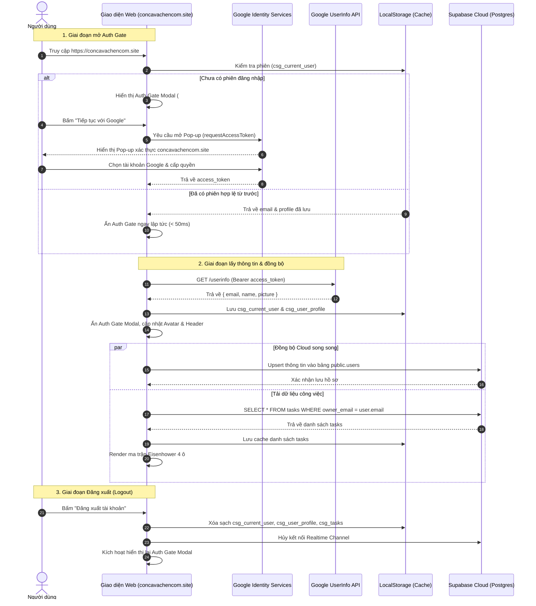

# API Spec & Sequence Diagram: Xác Thực Google Identity Services

## 1. Danh Sách Giao Diện Lập Trình (API Endpoints & Contracts)

### 1.1. Google Identity Services (GIS SDK - Client-side OAuth2)
- **Hàm khởi tạo**: `google.accounts.oauth2.initTokenClient(config)`
- **Tham số cấu hình**:
  ```json
  {
    "client_id": "868007254558-mg1mav2ucm3e911eoi951gc3al9v1vb6.apps.googleusercontent.com",
    "scope": "email profile openid",
    "callback": "handleGoogleTokenResponse(tokenResponse)",
    "error_callback": "handleGoogleTokenError(error)"
  }
  ```
- **Hàm kích hoạt**: `googleTokenClient.requestAccessToken({ prompt: 'select_account' })`
- **Dữ liệu trả về (TokenResponse)**:
  ```json
  {
    "access_token": "ya29.a0AfH6SM...",
    "token_type": "Bearer",
    "expires_in": 3599,
    "scope": "email profile openid https://www.googleapis.com/auth/userinfo.profile ..."
  }
  ```

---

### 1.2. Google UserInfo API (Trích xuất thông tin người dùng)
- **Giao thức**: `GET https://www.googleapis.com/oauth2/v3/userinfo`
- **Headers**:
  ```http
  Authorization: Bearer <access_token>
  Accept: application/json
  ```
- **Response Chuẩn (200 OK)**:
  ```json
  {
    "sub": "108392193810293810293",
    "name": "Nguyễn Trọng Tài",
    "given_name": "Tài",
    "family_name": "Nguyễn Trọng",
    "picture": "https://lh3.googleusercontent.com/a/ACg8oc...",
    "email": "trtainguyen2306@gmail.com",
    "email_verified": true
  }
  ```

---

### 1.3. Supabase REST API (Đồng bộ tài khoản & Task)

#### A. Cập nhật hồ sơ người dùng (Upsert User)
- **Giao thức**: `POST /rest/v1/users` (hoặc qua `supabaseClient.from('users').upsert(...)`)
- **Headers**:
  ```http
  apikey: <SUPABASE_ANON_KEY>
  Authorization: Bearer <SUPABASE_ANON_KEY>
  Content-Type: application/json
  Prefer: resolution=merge-duplicates
  ```
- **Request Body**:
  ```json
  {
    "email": "trtainguyen2306@gmail.com",
    "full_name": "Nguyễn Trọng Tài",
    "avatar_url": "https://lh3.googleusercontent.com/a/ACg8oc...",
    "last_sign_in_at": "2026-10-01T10:00:00.000Z"
  }
  ```
- **Response (201 Created / 200 OK)**:
  ```json
  {
    "success": true,
    "message": "Đã đồng bộ hồ sơ người dùng thành công"
  }
  ```

#### B. Tải danh sách công việc (Fetch Tasks)
- **Giao thức**: `GET /rest/v1/tasks?owner_email=eq.<user_email>&order=created_at.desc`
- **Response (200 OK)**: Mảng danh sách công việc của người dùng.

---

### 1.4. Google Apps Script RPC (Fallback Dual-Store)
Khi ứng dụng chạy trong môi trường Google Apps Script Web App:
- `google.script.run.getCurrentUser(email)`: Trả về phân quyền admin và số lượng feedback mới.
- `google.script.run.getTasks(email)`: Đọc danh sách task từ Google Sheets.

---

## 2. Sơ Đồ Trình Tự Xác Thực (Sequence Diagram)

Sơ đồ tuần tự thể hiện toàn bộ tương tác giữa Người dùng, Giao diện Web, Google Cloud và Supabase Database:



---

## 3. Quy Chuẩn Xử Lý Ngoại Lệ & Mã Lỗi (Error Handling Matrix)

| Tình huống ngoại lệ | Mã lỗi / Tín hiệu | Hành vi xử lý của hệ thống |
|---|---|---|
| Domain chưa cấu hình trên Google Cloud | `Error 400: origin_mismatch` | Bắt tại `error_callback`, hiển thị Toast cảnh báo: *"Chưa cấp quyền Authorized JavaScript origins trên Google Cloud"*, mở lại nút bấm. |
| Người dùng đóng pop-up Google | `access_denied` / `popup_closed` | Không báo lỗi nguy hiểm, reset nút "Tiếp tục với Google" về trạng thái bình thường. |
| URL chứa query lỗi từ redirect cũ | `?error=server_error...` | Hàm `initUserAuth()` tự động gọi `history.replaceState` dọn sạch thanh địa chỉ về `https://concavachencom.site/`. |
| Mạng chập chờn khi gọi Supabase | `NetworkError / Fetch failed` | Phục hồi dữ liệu từ `localStorage` để người dùng vẫn xem và dùng được offline (Offline-First). |
